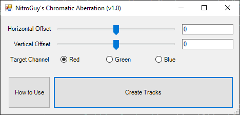
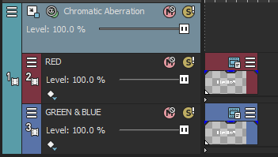

# Vegas_Chromatic_Aberration

A chromatic aberration script/"plugin" for MAGIX VEGAS Pro 18 (although it should also work on previous versions)

This "plugin" creates tracks in the VEGAS timeline which can be used to apply a chromatic aberration effect to video clips.

"Chromatic aberration" in this context refers to the positional offset of one color channel (red, green, or blue) from the others.

## Install

Grab the latest .exe binary from the [releases tab](https://github.com/NitroGuy10/Vegas_Chromatic_Aberration/releases/latest).
Move the .exe file into the Script Menu folder of your VEGAS installation.
Usually, it's something like C:\\Program Files\\VEGAS\\VEGAS Pro 18.0\\Script Menu

From Vegas, you can find it under Tools > Scripting > ChromaticAberration

You can also add it to your toolbar by double-clicking on the toolbar, choosing ChromaticAberration from the left menu, and clicking "Add ->".

## (IMPORTANT) How to Use

After choosing your settings and pressing "Create Tracks", the plugin will create 2 tracks (one for your target channel and one for the other channels) nested in a third parent channel.
To apply to chromatic aberration effect to a clip, copy and paste that clip into **BOTH** nested tracks as shown below.
Feel free to move the parent track around to your desired "height" in the timeline.

## How it Works

Each of the nested tracks contains a VEGAS Picture In Picture effect which applies a positional offset, of an amount based on your settings, in oppsing directions. Then, the first nested track isolates your target color channel and the second isolates the other color channels; this all is done using VEGAS Channel Blend. Finally, the compositing mode for both nested channels is set to "Add" so the colors correctly mix when the content of the two tracks overlap.

## "Plugin"?

\*sigh\* yeah this "plugin" is a really silly workaround using only the stuff that's available in VEGAS.
Ideally, I'd make an [OpenFX](http://openeffects.org/) plugin that uses an actual shader or something to apply the effect directly to a clip.
Unforunately, OpenFX seems to me like a scary and poorly documented beast in a language I not only don't know well but also [generally dislike](https://blog.prydt.xyz/posts/programming-language-opinions/#c-1).
